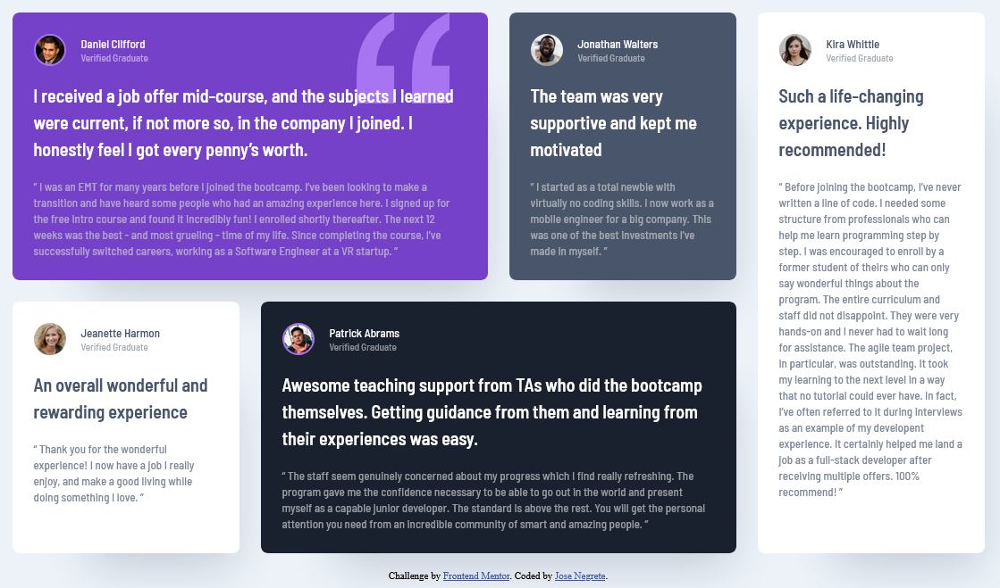

# Frontend Mentor - Testimonials grid section solution

This is a solution to the [Testimonials grid section challenge on Frontend Mentor](https://www.frontendmentor.io/challenges/testimonials-grid-section-Nnw6J7Un7). Frontend Mentor challenges help you improve your coding skills by building realistic projects. 

## Table of contents

- [Overview](#overview)
  - [The challenge](#the-challenge)
  - [Screenshot](#screenshot)
  - [Links](#links)
- [My process](#my-process)
  - [Built with](#built-with)
  - [What I learned](#what-i-learned)
  - [Continued development](#continued-development)
  - [Useful resources](#useful-resources)
- [Author](#author)

## Overview

### The challenge

Users should be able to:

- View the optimal layout for the site depending on their device's screen size

### Screenshot



### Links

- Solution URL: (https://www.frontendmentor.io/solutions/testimonial-grid-with-css-grid-and-flexbox-QaIBw0VBt7)
- Live Site URL: (https://josenegrete123.github.io/Testimonial-Grid-Project/)

## My process

### Built with

- Semantic HTML5 markup
- CSS custom properties
- Flexbox
- CSS Grid
- Mobile-first workflow

### What I learned

```css
.first {
    background: var(--violet) url("images/bg-pattern-quotation.svg");
    background-repeat: no-repeat;
    background-position: top right 10%;
}
```

### Continued development

Will continue with more practice on learning better CSS and HTML writing.

### Useful resources

- [background-repeat](https://developer.mozilla.org/en-US/docs/Web/CSS/background-repeat) - Learnt how to stop a background from repeating.
- [background-position](https://developer.mozilla.org/en-US/docs/Web/CSS/background-position) - Learnt how to position the background to a desired spot.

## Author

- Website - [Jose Negrete](https://github.com/josenegrete123)
- Frontend Mentor - [@josenegrete123](https://www.frontendmentor.io/profile/josenegrete123)